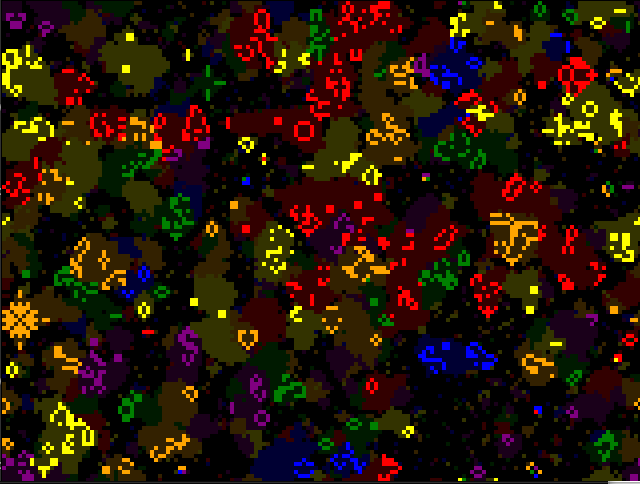
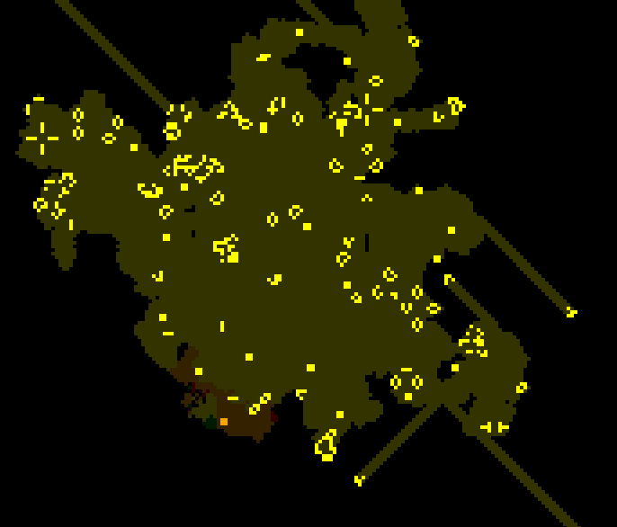

# Conway's Game of life in Nim with SDL2

## Features:
- With colors (inspired by [Jim Blackler's version](https://jimblackler.net/blog/?p=384)):
  - At startup the cells are assigned colors randomly
  - Newly-created cells take the most common color of neighbouring cells
  - When cells die, they leave a shaded version of their original color
- Borderless (optional)
- REL import

## Why?

Because I needed something to tinker with. This started as a one day experiment, which got a bit out of hand. The code is not optimized in any way and really just my playground.

## Other Nim implementations

There are plenty of other Game of life implementations in Nim on Github for example. Only after I started tinkering, I found another [Nim implementation using SDL/Nimgame2](https://github.com/KieranP/Game-Of-Life-Implementations) by [andrew644](https://github.com/andrew644), which is a lot nicer. Unfortunately I couldn't get it to work under WSL2, because SDL can't find an audio device...

## Build

You will need[Nim](https://nim-lang.org/install_unix.html) as well as [SDL2](https://wiki.libsdl.org/Installation) installed.

Run `nimble build` (which also installs required Nim packages).

The resulting binary is called `gol`.

Run `./gol -h` to see command-line arguments.

For importing RLE patterns (e.g. downloaded from the [LifeWiki](https://www.conwaylife.com/)), also add some padding, e.g. `./gol -f wilma.rle -c 2 -p 100`

## TODO

- Support "unlimited" universe with zoom
- Speed improvements:
  - Use sparse matrix
  - Use of fillRect instead of drawPoint (for `c`>1)

# Screenshots

## From a random start position

## [Methusaleh Wilma](https://www.conwaylife.com/wiki/Wilma)

After 1043 generations with a few escaping [gliders](https://www.conwaylife.com/wiki/Glider)

